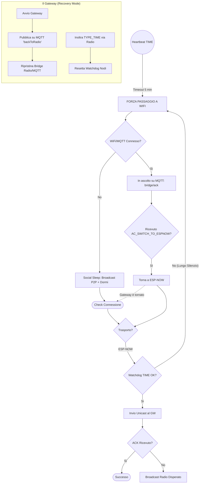

# Resilient Star: Logica di Failover e Resilienza (v4.5)

Questa documentazione descrive il meccanismo di sopravvivenza della rete in caso di guasto del Gateway o del Broker MQTT.

## Strategia a Tre Livelli

La rete opera secondo una gerarchia di trasporto per massimizzare l'efficienza energetica e la stabilità:

1.  **Tier 1: ESP-NOW (Nativo)**: Trasporto primario via radio verso il Gateway.
2.  **Tier 2: WiFi + MQTT**: Attivato in caso di fallimento persistente del Gateway (Watchdog TIME).
3.  **Tier 3: Broadcast Sociale**: In caso di isolamento totale (No Gateway + No WiFi), i nodi comunicano direttamente tra loro per funzioni base.

## Grafico dei Flussi (Mermaid)

## Watchdog di Resilienza (Active Heartbeat)

A differenza della versione precedente (passiva), ogni nodo ora monitora il pacchetto `TYPE_TIME` (0x08) inviato da Node-RED e inoltrato dal Gateway.
*   **Trigger**: Se non viene ricevuto un `TYPE_TIME` per più di 5 minuti.
*   **Azione**: Il nodo conclude che il Gateway è offline e attiva autonomamente l'interfaccia WiFi per connettersi direttamente al broker.

## Gateway Recovery (Il "Richiamo")

Quando il Gateway viene riavviato (es. dopo un blackout), invia immediatamente un pacchetto di comando `AC_SWITCH_TO_ESPNOW` sul topic MQTT di sistema.
*   I nodi che si trovano in modalità WiFi ricevono questo comando.
*   Al ricevimento, chiudono la connessione WiFi e tornano istantaneamente in modalità radio (ESP-NOW), ripristinando l'efficienza della rete.

## Social Sleep (Modalità Notturna/Emergenza)

Se un dispositivo non riesce a contattare né il Gateway né il Broker:
1.  Spegne il display Nextion (`thup=1`/`sleep=1`).
2.  Invia i dati critici in Broadcast Radio verso gli altri nodi (es. temperatura esterna per i Chrono).
3.  Entra in una fase di riposo prolungata prima di riprovare il ciclo di connessione.